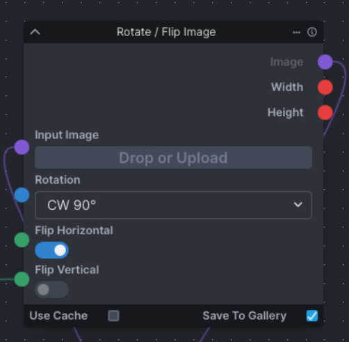

# Rotate / Flip Image

A simple InvokeAI node that can apply one or more of these transformations:

- Rotate an image by 90°, 180°, or 270° (which may alter the image dimensions)
- Flip the image horizontally
- Flip the image vertically



### Requirements

- `pip install PIL`

### Installation

Navigate to your InvokeAI installation's `nodes` folder, and run
```sh
git clone https://github.com/thinkyhead/image-rotate-flip
```
or, just click the green button in the upper-right, download the zip, and unzip it in your `nodes` folder.

### Future Work

- Expand to perform a wider range of operations in one convenient (but not too ugly) node

### See Also

- [invoke-rotate-image](//github.com/Pfannkuchensack/invoke-rotate-image)
- [composition-nodes/image_rotate](//github.com/dwringer/composition-nodes/blob/main/image_rotate.py)
